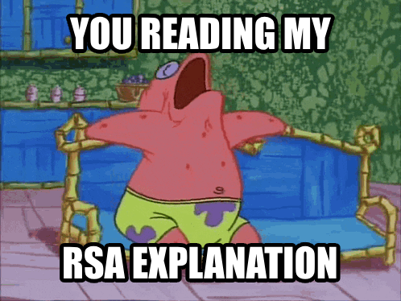
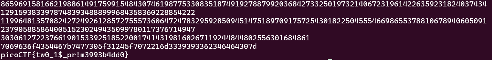

# 

## Description

<div style="text-align: justify">This service provides you an encrypted flag. Can you decrypt it with just N & e?<br>
Connect to the program with netcat:<br> $ nc verbal-sleep.picoctf.net 60275<br> The program's source code can be downloaded <a href="additional-files/encrypt(1).py" download>here.</a></div>

## Hints

<div style="text-align: justify">
1. How much do we trust randomness? <br>
2. Notice anything interesting about N? <br>
3. Try comparing N across multiple requests <br></div>

## Points

200

## Solving Steps

### Step 1 (Running the netcat)

<div style="text-align: justify">Upon running the given netcat, a message will appear. If you try to run it again, it will result in different numbers (except for the e). So don't get confused when you see that your numbers are different than mine. At the end it'll result in the same flag.</div>

```
N: 17319383163324397722983519830968614923975506616703749838557759840736854665003946428134463922845271846364807486825831876679574967869777999368716720457708446
e: 65537
cyphertext: 13877317020982354317766469129877058233951466354217310151548834457021423168295388690377486483101981197969069342989878309792590149732290406757794777233230341
```

### Step 2 (Learning what an RSA encryption is)

<div style="text-align: justify">When given super long numbers like these with the variables N, e, and cyphertext (or sometimes known as c), we can 100% assume that it's a RSA encryption. Luckily, I've learned what an RSA encryption is before in another picoCTF challenge so I will explain it simply to the beest of my abilities. You can also just go to this website which is way better at explaining RSA than me: <a href="https://www.geeksforgeeks.org/rsa-algorithm-cryptography/">RSA Algorithm in Cryptography</a></div><br>

<div style="text-align: justify">RSA encryption is a method of encryption that uses keys to both decrypt and encrypt messages. Now there are two types of key-based encryption, which are: symmetric and asymmetric. A symmetric key-based encryption only has one key that is used to both encrypt and decrypt a message. This can lead to less security because the key, which is supposed to be private, has to be shared to the person you want to send the message to so that they can decrypt it.</div><br>

<div style="text-align: justify">This is where asymmetric key-based encryption comes in handy. This method of key-based encryption has two keys instead of only one, which are the private and public key. Public keys are keys that pose no threat if shared, vice versa for private keys. One is only used for encrypting while the other is only used for decrypting. We'll take sending emails as an analogy. When you send an email to someone, the public key could be your email address and the private key could be your password.</div><br>

<div style="text-align: justify">RSA is a form of asymmetric key-based encryption. In RSA encryption, the public key will be used for encryption while the private key will be used for decryption. So person A would send a message that's encrypted with person B's public key. On the other hand, when person B receives the message, they decrypt it using their private key.</div><br>

<div style="text-align: justify">There are three steps in an RSA algorithm, which are: key generation, encryption, and decryption. Let's start with key generation shall we.</div>

#### Key Generation

<div style="text-align: justify">In key generation, we're aiming to make three things: the public key (n), the euler totient [Φ(n)], and the decryption exponent (d). <br><br>

<li> We find the public key by choosing two large prime numbers called P and Q. We multiply P and Q to be the public key.<br><br>

<li> We find the euler totient by multiplying (P-1) and (Q-1)<br><br>

<li> We find the decryption exponent by doing a modular multiplicative inverse of e mod Φ(n)
</div>

#### Encryption

<div style="text-align: justify">Now we're getting to the fun stuff. Before encrypting a message, we first need to make that message into a numerical format. There's many ways to do this but the most common way (and the way that this challenge does it) is to turn that message into a hexadecimal (base-16) and change it into decimal form (base-10).</div><br>

<div style="text-align: justify">After getting your message (m), we need to use modular exponentiation (don't ask me what that is I don't know either I'm not a mathematician). Basically, find M<sup>e</sup> mod n and you'll get the encrypted message.</div>

#### Decryption

<div style="text-align: justify">To decrypt a RSA encrypted message, just do the same thing but with different variables now: C<sup>d</sup> mod n</div><br>



### Step 3 (Decrypting the encrypted message)

<div style="text-align: justify">If you're reading this step, hopefully you already understand how to do RSA encryption. If not, then good luck trying to understand it. Now you might be wondering, how do we find the P and Q just from the public key? Well to do that, there's this handy website called <a href="https://factordb.com/">Factordb</a>. This website can factorize any number, no matter how big it is so that we can get two values that when multiplied will result in that number. Those two numbers are our P and Q. With the public key that I got, the P and Q would be: 2 and </div><br>

<div style="text-align: justify">Luckily for me, I've made a python solver for RSA decryption before. So all I needed to do was input the values into the python program lol. Here's the python program along with the result:</div>

```
# Given values
c = 13877317020982354317766469129877058233951466354217310151548834457021423168295388690377486483101981197969069342989878309792590149732290406757794777233230341

n = 17319383163324397722983519830968614923975506616703749838557759840736854665003946428134463922845271846364807486825831876679574967869777999368716720457708446

e = 65537

P = 2

Q = 8659691581662198861491759915484307461987753308351874919278879920368427332501973214067231961422635923182403743412915938339787483934888999684358360228854223

# Calculate phi
phi = (P - 1) * (Q - 1)

# Calculate the private key (d)
d = modInverse(e, phi)

# Decrypt the ciphertext
m = power(c, d, n)

print(phi)
print(d)
print(m)
print(hex(m)[2:])
print(codecs.decode(hex(m)[2:], 'hex').decode('utf-8'))
```

If you try to run this program, it will result in the flag.

<br>

<b>picoCTF{tw0_1$\_pr!m3993b4dd0}</b>

### Step 4 (Alternative way)

<div style="text-align: justify">If you're too lazy to make a solver, you can also use the <a href="https://www.dcode.fr/rsa-cipher">dcode</a> website to do all the operations I just did. All the calculators are available in the same webpage in the "Complementary Helper Tools" so that you can find all the values needed.</div><br>


