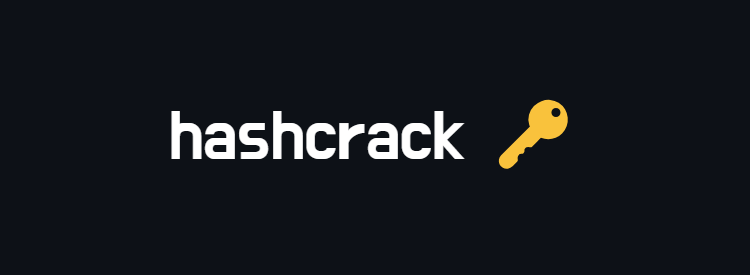

# 

A company stored a secret message on a server which got breached due to the admin using weakly hashed passwords. Can you gain access to the secret stored within the server?
Access the server using nc verbal-sleep.picoctf.net 62644 

## Hints

1. Understanding hashes is very crucial.  
2. Can you identify the hash algorithm? Look carefully at the length and structure of each hash identified. <a href="https://primer.picoctf.org/#_hashing">Read more here.</a> 
3. Tried using any hash cracking tools?  

## Points

100

## Solving Steps

 Upon running the netcat given, a text will pop up showing a hash and an input asking for what the original text of the hash is. This challenge is simple using a handy online tool: <a href="https://crackstation.net/">Crackstation</a>
 

 Copy paste the given hash into the website and it'll give you the original password. But after the first password, there are two more hashed passwords that you need to find. Luckily the website can detect a handful of different hashes and could identify what the hash is. After doing all that, you will end up with the flag.
 

 

<b>picoCTF{UseStr0nG*h@shEs*&PaSswDs!\_3eb19d03}</b>
