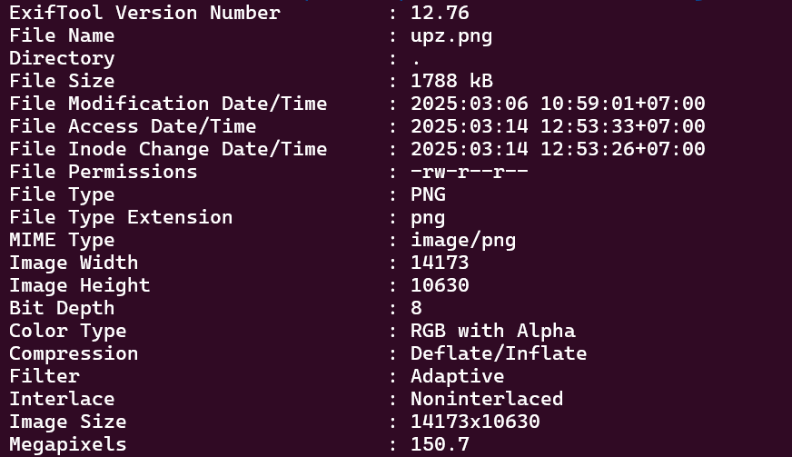
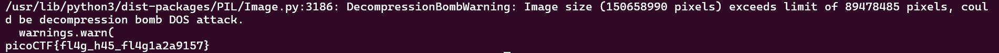

# 

## Description

<div style="text-align: justify"> A group of underground hackers might be using this legit site to communicate. Use your forensic techniques to uncover their message
Additional details will be available after launching your challenge instance. </div>

## Hints

<div style="text-align: justify"> In the country that doesn't exist, the flag persists </div>

## Points

100

## Solving Steps

### Step 1 (Finding the "flag")

<div style="text-align: justify">This challenge gives us an instance to run which then we'll be directed to a website. Inside of the website is a bunch of country flags, probably even every single country. But after seeing the hint, there must be one flag that's fake. So I got to searching country by country to see which one seems odd. Fortunately for me, the odd one out is pretty obvious.</div><br>


<div style="text-align: justify">After doing research to 100% say that this isn't a country (which it isn't), I then realized that this isn't an OSINT challenge. Since it's a forensics challenge and that most forensics challenges are either searching through partitions, images, and pcap files, I tried downloading the image of the Upanzi logo. Upon closer inspection of the metadata, the image size is A WHOPPING 14173x10630🥀💀❗❗</div><br>



<div style="text-align: justify">Something is definetly fishy about this png file and we're definetly on the right track to solving the flag.</div>

### Step 2 (Figuring out what to do)

<div style="text-align: justify">I tried numerous things to try to get the flag. I tried tools and commands such as zsteg, pngcheck, strings, binwalk, and many others but to no avail. I even tried to use the pylsb from before but the file was just too big. Then I had an idea to google up what stepic is. At first I thought it was just some word play from "Steganography" and "epic". It turns out that stepic is a python library and it does the exact same thing as pylsb so I'm not sure where it went wrong with pylsb honestly. But that doesn't matter.</div><br>

<div style="text-align: justify">I installed the library and made a simple python solver</div><br>

```
import stepic
from PIL import Image

img = Image.open("upz.png")
hidden_data = stepic.decode(img)
print(hidden_data)
```

<div style="text-align: justify">At first it resulted in the same error message as pylsb, but after a few seconds the real flag popped up out of nowhere.</div><br>

<br>

<b>picoCTF{fl4g_h45_fl4g1a2a9157}</b>
