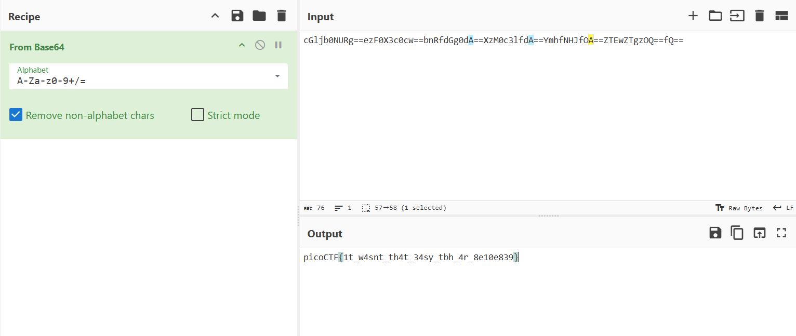

# 

## Description

A digital ghost has breached my defenses, and my sensitive data has been stolen! 😱💻 Your mission is to uncover how this phantom intruder infiltrated my system and retrieve the hidden flag.
To solve this challenge, you'll need to analyze the provided PCAP file and track down the attack method. The attacker has cleverly concealed his moves in well timely manner. Dive into the network traffic, apply the right filters and show off your forensic prowess and unmask the digital intruder! Find the PCAP file here <a href="additional-files/myNetworkTraffic.pcap" download>Network Traffic PCAP file</a> and try to get the flag.

## Hints

1. Filter your packets to narrow down your search.  
2. Attacks were done in timely manner.  
3. Time is essential  

## Points

50

## Solving Steps

 After downloading the PCAP file and opening it in Wireshark, we're presented with 22 packets. I tried searching up strings like "pico", "picoCTF", and "flag" but no results show up. I also tried following the TCP stream but there wasn't any result other than a random string that looks like base64 encoding (I tried decoding it but it was just random gibberish).
 

 Then I had a realization that maybe the flag is in the form of an encoding. So I searched up the string <b>"cgl"</b>, which is the very start of a base64 encoded string beggining with the word "pico". Doing this results in me being directed to the 9th packet in the file.
 

I then check the remaining packets and turns out they all have a part of the base64 encoded flag. If you combine all of them and decode it, the results are: 
 

 

<b>picoCTF{1t_w4snt_th4t_34sy_tbh_4r_8e10e839}</b>
