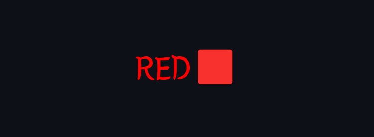
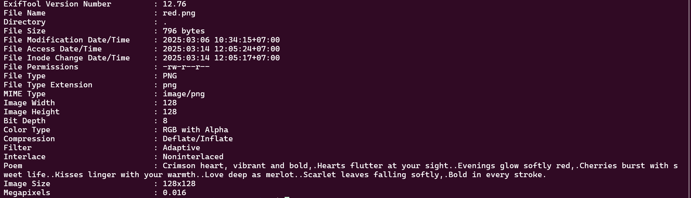
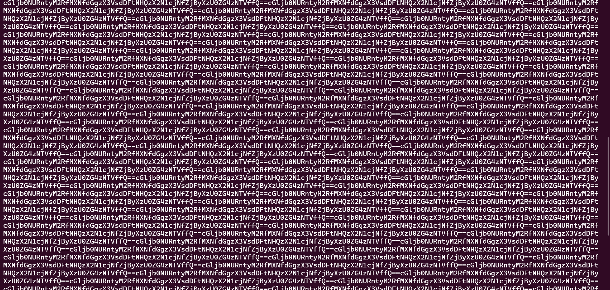
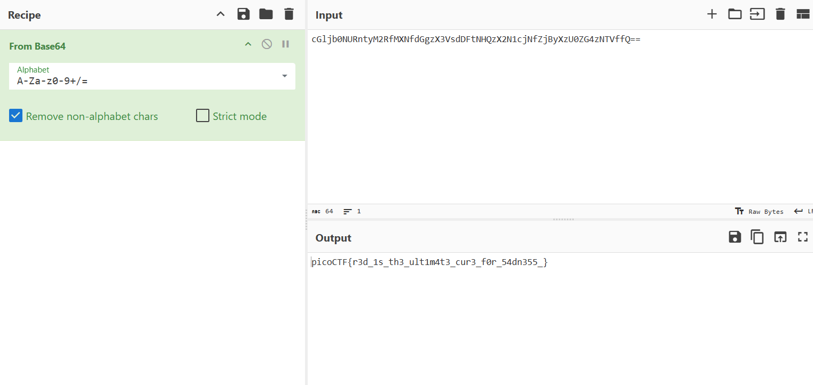

# 

## Description

 RED, RED, RED, RED Download the image: red.png <a href="additional-files/red.png" download>red.png</a>

## Hints

1. The picture seems pure, but is it though? 
2. Red?Ged?Bed?Aed? 
3. Check whatever Facebook is called now.

## Points

100

## Solving Steps

### Step 1 (Checking the metadata for clues)

The first thing I did in this challenge along with every other forensics challenge like this is checking the metadata of the file using <b>exiftool</b>. Doing this would result in something unusual, a poem hidden inside the metadata.
 

Crimson heart, vibrant and bold,  Hearts flutter at your sight.  Evenings glow softly red,  Cherries burst with sweet life.  Kisses linger with your warmth.  Love deep as merlot.  Scarlet leaves falling softly,  Bold in every stroke.  
It took me a while to realize as I tried to decipher what this poem could mean, but it's actually pretty easy. If you look more carefully you can see that the first letter of each line spells out: "CHECK LSB".

### Step 2 (Learning what an LSB is)

I didn't know what an LSB was, so I got to searching and I found this website explaining what it is: <a href="https://medium.com/@renantkn/lsb-steganography-hiding-a-message-in-the-pixels-of-an-image-4722a8567046">LSB Steganography — Hiding a message in the pixels of an image</a>
 

If you're too lazy to read the whole article, I'll explain what an LSB is to you in a nutshell. So basically, images are made up of tons of pixels. Now each pixel has a color and the color of that pixel is made up of 3 channels: red, green, and blue. Each of these channels requires 1 byte (8 bits) to define the pixel's color. You can see this example when you want to set a background's color in HTML, you'd usually see that the RGB requires three numbers spanning from 0 to 255 (which are 00000000 to 11111111 in binary). These are the 1 byte (8 bits).
 

Let's say, the color of our pixel in the blue channel is 11111111 (255 in decimal). If we take out the last bit in the binary making it 11111110 (254 in decimal), we successfully took 1 bit while still making the color seem the same to the human eye. Now one bit might seem small, but remember that we have 3 different channels and thousands or maybe even hundreds of thousands of pixels in our image. With the excess bits we've gathered, we can hide a message with it inside of the image. This is called <b>Steganography</b>

### Step 3 (Finding the hidden message)

Now that we know what to do, let's find a tool that could help us find the flag hidden in the image. Luckily, the same website I went into to learn what an LSB is provided a link to a <a href="https://github.com/RenanTKN/pylsb">github repository</a> that contains a python program to decipher these kinds of challenges. After downloading the program and running it towards the given png of the challenge, we get a txt file.
 

I thought the txt file would contain the flag, but when I printed out the file's contents this is what appeared
 

Just when I thought I hit a dead end I realized something. These weren't random gibberish, it looks like a base64 encoded string repeated over and over again for whatever reason. So I copied one part of the message and pasted it to a CyberChef's base64 decoder.
 

 

<b>picoCTF{r3d_1s_th3_ult1m4t3_cur3_f0r_54dn355}</b>
