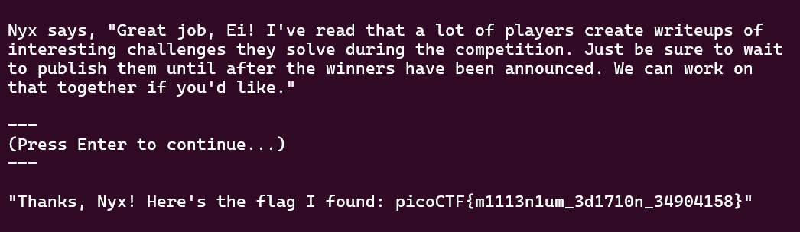

# 

## Description

Play this short game to get familiar with terminal applications and some of the most important rules in scope for picoCTF. Connect to the program with netcat:   $ nc verbal-sleep.picoctf.net 49930

## Hint

When a choice is presented like [a/b/c], choose one, for example: c and then press Enter.

## Points

10

## Solving Steps

This challenge is pretty self explanatory, all you need to do is run the netcat and it'll play a short story about picoCTF in the year 3025. Sometimes it'll display choices you need to make and you can choose them with either a, b, or c. Pick the right choice and the story will move on. At the end of the short story, the flag will be presented. This is basically a sanity check.
 

